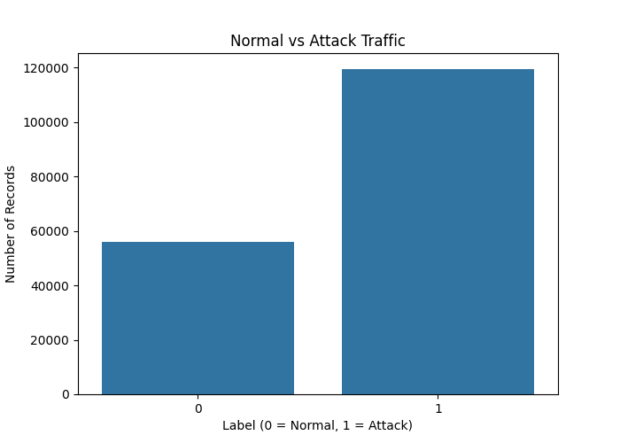
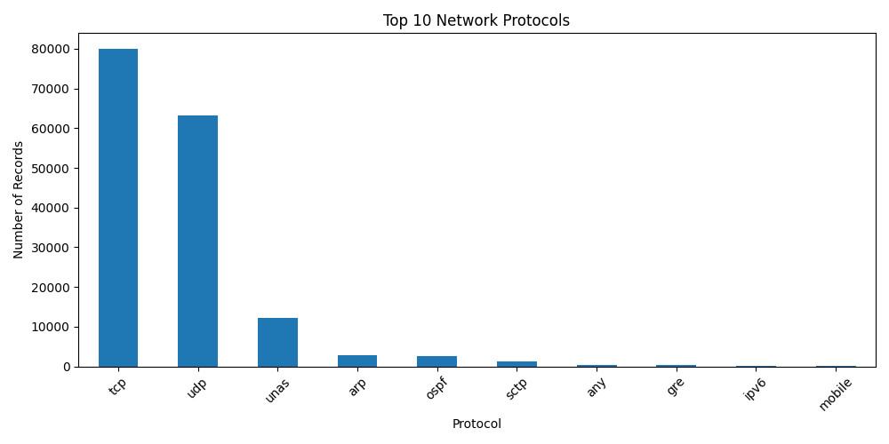
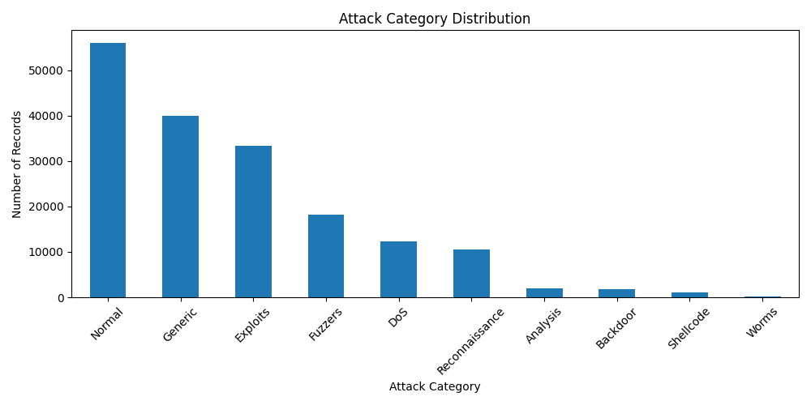
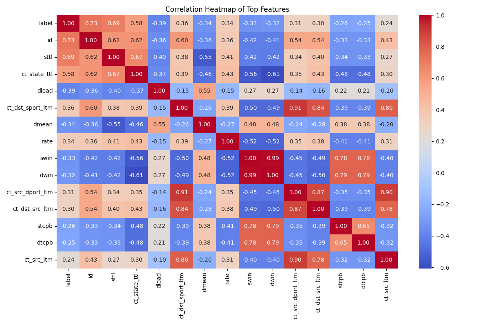
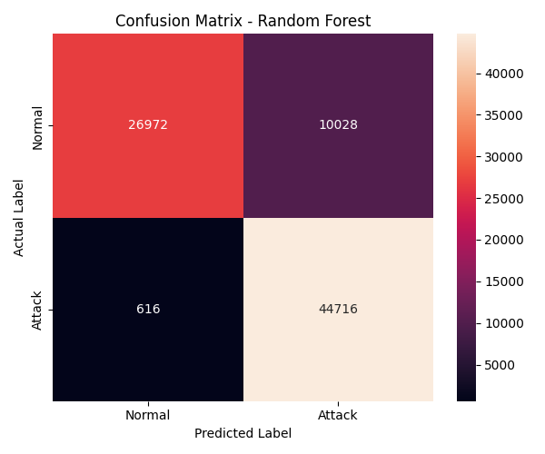
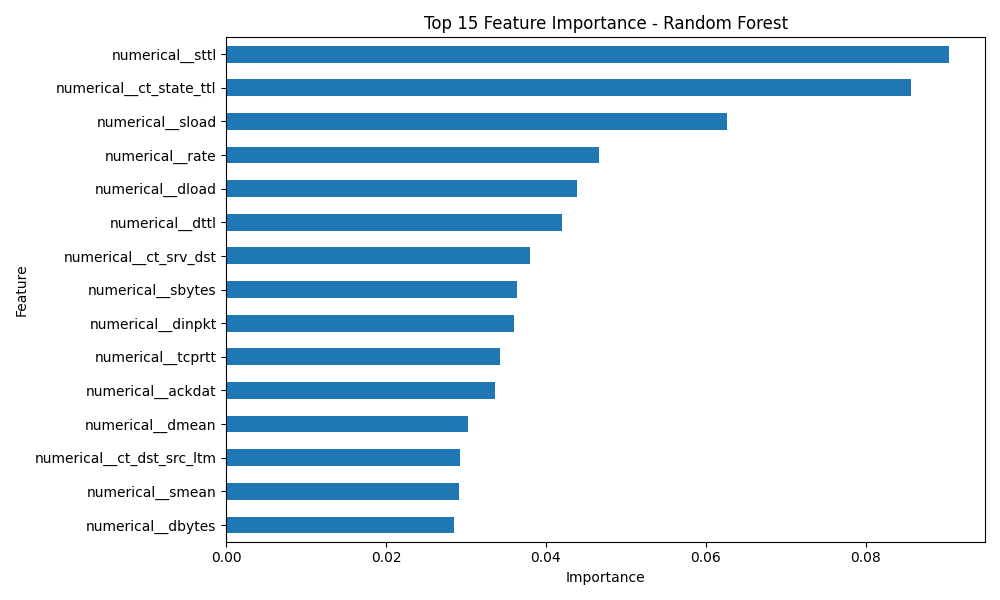
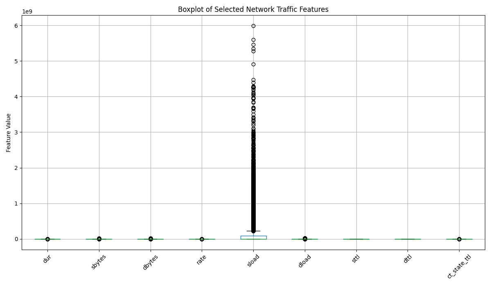

# Network Intrusion Detection using Supervised Machine Learning

A supervised machine learning project for detecting malicious network traffic using the **UNSW-NB15 dataset** and a **Random Forest Classifier**.

## 📌 Project Overview

Network Intrusion Detection Systems (NIDS) are used to identify suspicious or malicious activities in network traffic.

This project develops a binary classification model that classifies network traffic into:

- **0 → Normal Traffic**
- **1 → Attack Traffic**

The project covers data preprocessing, exploratory data analysis, feature selection, model training, cross-validation, evaluation, feature importance analysis, and outlier analysis.

## 🎯 Objectives

- Analyze network traffic data.
- Preprocess numerical and categorical features.
- Identify important network traffic characteristics.
- Build a supervised machine learning model.
- Evaluate the model using multiple classification metrics.
- Analyze false positives and false negatives.
- Understand important features contributing to intrusion detection.

## 📂 Dataset

**Dataset:** UNSW-NB15

The UNSW-NB15 dataset contains modern normal network activities and different types of simulated attack behaviours.

The dataset provides predefined training and testing sets.

The dataset CSV files are not included in this repository because of their large size.

**Official Dataset Source:**  
https://research.unsw.edu.au/projects/unsw-nb15-dataset

## 🧠 Machine Learning Model

### Random Forest Classifier

Random Forest was selected because it:

- Handles nonlinear relationships.
- Works well with tabular network traffic data.
- Is relatively robust to noisy data and outliers.
- Provides feature importance for model interpretation.
- Supports class weighting for imbalanced data.

## ⚙️ Preprocessing

The following preprocessing steps were performed:

1. Checked for missing values.
2. Checked for duplicate records.
3. Removed the `id` column because it is only an identifier.
4. Removed `attack_cat` to prevent target-related information leakage.
5. Separated features and target.
6. Applied One-Hot Encoding to categorical features.
7. Used `class_weight="balanced"` to handle class imbalance.

### Categorical Features

- `proto`
- `service`
- `state`

### Numerical Features

The remaining network traffic characteristics were treated as numerical features.

### Target

- `label`

## 🔍 Exploratory Data Analysis

The dataset was explored using different visualizations to understand network traffic patterns.

The analysis includes:

- Normal vs Attack Traffic
- Network Protocol Distribution
- Attack Category Distribution
- Correlation Heatmap
- Confusion Matrix
- Random Forest Feature Importance
- Outlier Analysis

## 📸 Project Visualizations

### Normal vs Attack Traffic

### Network Protocol Distribution

### Attack Category Distribution

### Correlation Heatmap

## 📊 Model Evaluation

### Confusion Matrix

## 📈 Feature Importance

## 🚨 Outlier Analysis

## 🤖 Model Training and Validation

A **Random Forest Classifier** was trained using the predefined training dataset.

Five-fold cross-validation was performed on the training data to evaluate model stability before final testing.

### Cross-Validation Result

**Mean F1 Score: 93.85%**

The five-fold cross-validation F1 scores were:

- Fold 1: 94.69%
- Fold 2: 96.67%
- Fold 3: 98.19%
- Fold 4: 94.04%
- Fold 5: 85.67%

The variation between folds indicates that model performance changes across different subsets of the training data.

## 📊 Model Evaluation

The final model was evaluated using the official test dataset.

| Metric | Score |
|---|---:|
| Accuracy | 87.07% |
| Precision | 81.68% |
| Recall | 98.64% |
| F1 Score | 89.36% |

### Confusion Matrix

## 📊 Confusion Matrix

The confusion matrix shows how the Random Forest model classified normal and attack network traffic on the official UNSW-NB15 test dataset.

| Actual / Predicted | Normal | Attack |
|---|---:|---:|
| **Normal** | 26,972 | 10,028 |
| **Attack** | 616 | 44,716 |

The model correctly detected **44,716 attack instances**, while **616 attack instances** were classified as normal. It also produced **10,028 false positives**, where normal traffic was classified as an attack.

 ## Key Observation

The confusion matrix indicates that the Random Forest model is highly effective at identifying malicious network traffic. Most attack instances were correctly classified, with only a small number of attacks being missed. However, the number of false positives shows that some normal network connections were classified as attacks. This suggests that the model has strong attack detection capability, while further tuning could help reduce unnecessary security alerts.